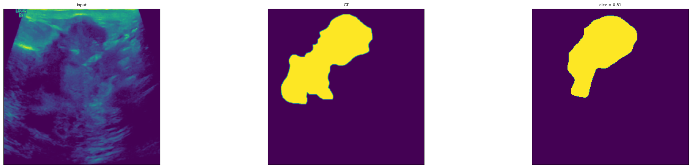
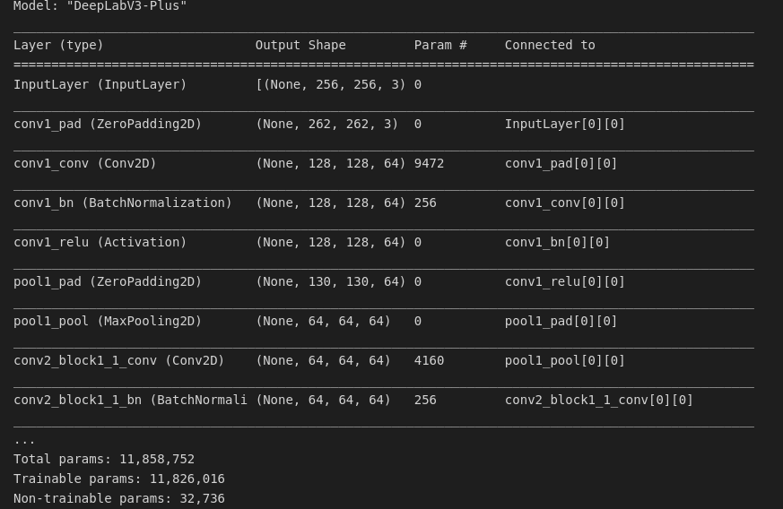
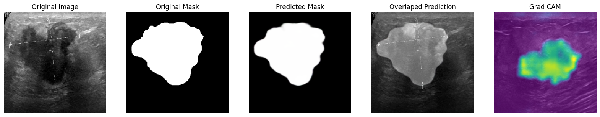
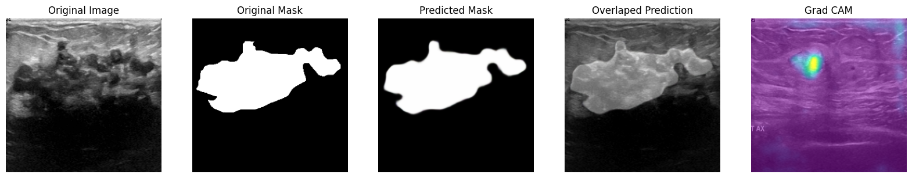
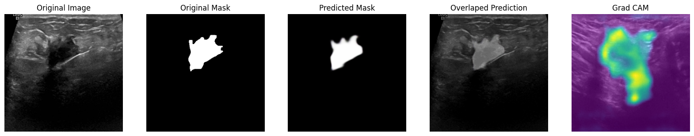
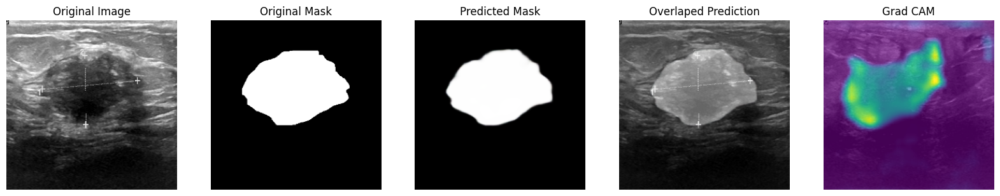
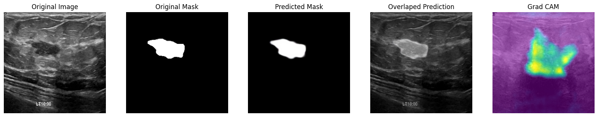
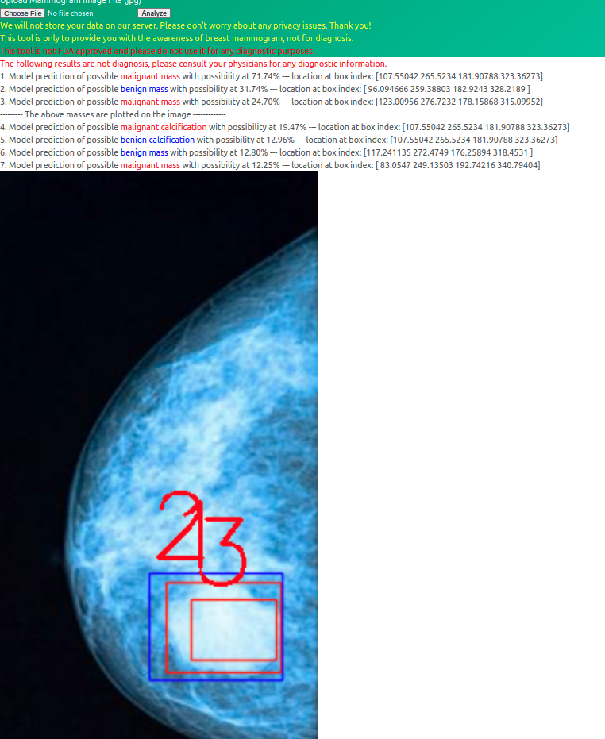

## 数据集
暂用公开数据集**BUSI**(Breast Ultrasound Images Dataset)进行训练
https://academictorrents.com/details/d0b7b7ae40610bbeaea385aeb51658f527c86a16

## 模型选择

基于 **unet++** 的模型表现较差

  <em>暂不考虑使用</em> 
 
  
   

考虑到 **计算资源充足**，所以选用更复杂但能提取更多信息的**DeepLabV3-Plus**模型来取得更好的分割结果

  模型结构 
 

## 环境配置
模型训练与验证的代码集合在**Jupyter**笔记本中
主要环境为：**tensorflow-gpu=2.6.0, cuda 11.3**

## 模型效果
*exmaple1:*

*example2:*

*example3:*

*example4:*

*example5:*

可以看到模型的效果卓越

## 模型部署
经过学习准备使用**Flask框架**开发建议网页demo
样例网站（X-ray） http://mammo.neuralrad.com:5300/upload

### 后续工作
由于目前主流框架**Tensorflow**与**Pytorch**的部署方式有很大不同，计划先开发技术较成熟的Tensorflow模型的部署，后开发Pytoch模型的部署,便于日后展示基于不同框架开发的模型效果